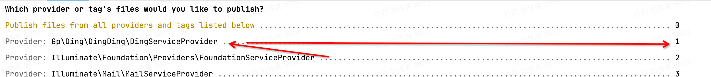

# gp-ding

> 在钉钉官方SDK基础上进行封装,简便使用,本SDK仅仅支持 laravel5.8 或 更高版本框架

```
For 
    Laravel >= 5.8 
    PHP >= 7.4
```

```
1.env 追加
    DING_APP_KEY
    DING_APP_SECRET
    
    EVENT_TOKEN
    EVENT_ASE_KEY
    EVENT_KEY

    
2.composer require liuweiliang/groupding

3.config/app.php

    providers[
        Gp\Ding\DingDing\DingServiceProvider::class
    ]
    
    aliases[
        'Api'=> \Gp\Ding\Client\ClientApiFacade::class, 
    ]
    
4.php artisan vendor:publish
```

此处有图

```
5.选择对应的服务发布 如上图 就输入 1

6.在 /config/logging.php 内 追加 如下配置 

     'ding'=>[
            'driver' => 'daily',
            'path' => storage_path('logs/ding.log'),
            'level' => env('LOG_LEVEL', 'debug'),
            'days' => 7,
     ],
     
7.执行 php artisan config:clear
```

### 部分 API 实现

```     
    生成 access_token
    \Gp\Ding\DingDing\DingTalkService::getAccessToken()
    
    通过手机号 获取 钉Id
    \Gp\Ding\DingDing\DingTalkService::getUserIdByMobile("手机号")
    
    创建普通群 具体参数 请进入SDK 内查看
    \Gp\Ding\DingDing\DingTalkService::createChat(
         .....
    )
    
    创建场景群 具体参数 请进入SDK 内查看
    \Gp\Ding\DingDing\DingTalkService::createSceneChat(
           .....
    )
    
    向群内添加用户
    \Gp\Ding\DingDing\DingTalkService::storeChat('群id','dingId1,dingId2')
    
    获取 JSAPI 的 Ticket
    \Gp\Ding\DingDing\DingTalkService::getJsApiTicket()
    
    
    钉一下 ⚠️是专属钉的功能
     Gp\Ding\DingDing\Ding::ding(
        array 钉id,
        string 内容
     )
     
     钉电话 ⚠️是专属钉的功能  ⚠️记得关闭手机的拦截软件
     Gp\Ding\DingDing\DingPhone::ding(
        array 钉id,
        string 内容
     )
     
      
     普通卡片
     Gp\Ding\DingDing\DingCard::main(
        .....
     )
     
     更新卡片（包含吊顶）
     Gp\Ding\DingDing\DingUpdateCard::main(
        .....
     )
     
     创建并启用吊顶 场景群使用
      \Gp\Ding\DingDing\DingTalkService::createOpenCeiling(
        .....
      )
     
     //监听事件
     $data = $this->request->input();
     $crypt = new Gp\Ding\DingDing\DingCallbackCrypto(config('ding.event_token), config('ding.event_ase_key'), config('ding.event_key));
     $text = $crypt->getDecryptMsg($data['msg_signature'], $data['timestamp'], $data['nonce'], $data['encrypt']);
     
     
     return \response()->json(json_decode($crypt->getEncryptedMapDetail("success", $data['timestamp'], $data['nonce'])));

```